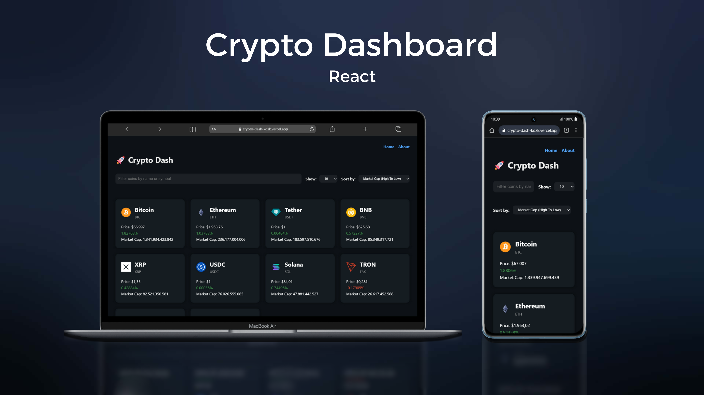

# 🚀 Crypto Dash

Crypto Dash is an interactive dashboard developed in React for real-time visualization and analysis of cryptocurrencies. The application consumes data from an external API to display up-to-date information on prices, variations, market volume, and historical charts of the coins.

The project was built focusing on best practices in frontend development, including route organization, API consumption, handling of asynchronous states, and user experience.



# Technologies Used

- React JS
- React Router
- Coingecko API
- Git & Github

# Coingecko Implementation

The integration with the CoinGecko API in Crypto Dash was achieved using the Fetch API with async/await within the useEffect, allowing for dynamic retrieval of up-to-date cryptocurrency market data. The API URL was configured via an environment variable, ensuring better organization and flexibility. The application manages data loading, error, and storage states to provide appropriate visual feedback. After the request, the data is processed in the frontend with filters, custom sorting, and immutable array manipulation, providing an interactive and efficient experience without multiple API calls.

Here's the Code:

```jsx
import { useState, useEffect } from "react";
const API_URL = import.meta.env.VITE_API_URL;

const App = () => {

  const [coins, setCoins] = useState([]);
  const [loading, setLoading] = useState(true);
  const [error, setError] = useState(null);
  const [limit, setLimit] = useState(10);
  const [filter, setFilter] = useState('');
  const [sortBy, setSortBy] = useState('market_cap_desc')


  useEffect(() => { 

    const fetchCoins = async () => {
      try{
        const res = await fetch(`${API_URL}&order=market_cap_desc&per_page=${limit}&page=1&sparkline=false`);
        if(!res.ok) throw new Error('Failed to fetch data');
        const data = await res.json();
        console.log(data);
        setCoins(data);
      } catch (err){
        setError(err.message)
        console.log(err)
      } finally{
        setLoading(false)
      }
    }

    fetchCoins();

   }, [limit]);

   const filteredCoins = coins.filter((coin) => {
    return coin.name.toLowerCase().includes(filter.toLowerCase()) || coin.symbol.toLowerCase().includes(filter.toLowerCase())
   })
   .slice()
   .sort((a, b) => {
    switch(sortBy) {
      case 'market_cap_desc':
        return b.market_cap - a.market_cap; 
      case 'market_cap_asc':
        return a.market_cap - b.market_cap  
      case 'price_desc':
        return b.current_price - a.current_price;
      case 'price_asc':
        return a.current_price - b.current_price;
      case 'change_desc':
        return b.price_change_percentage_24h - a.price_change_percentage_24h;
      case 'change_asc':
        return a.price_change_percentage_24h - b.price_change_percentage_24h
    }
   })
}

```

# Completeness

Although it's a simple portfolio project, I've implemented the following

- Limit Selector
- Filter Coins
- Sort Order Selector
- Not Found Page
- Fetch Coin Details
- Loading Spinner   

